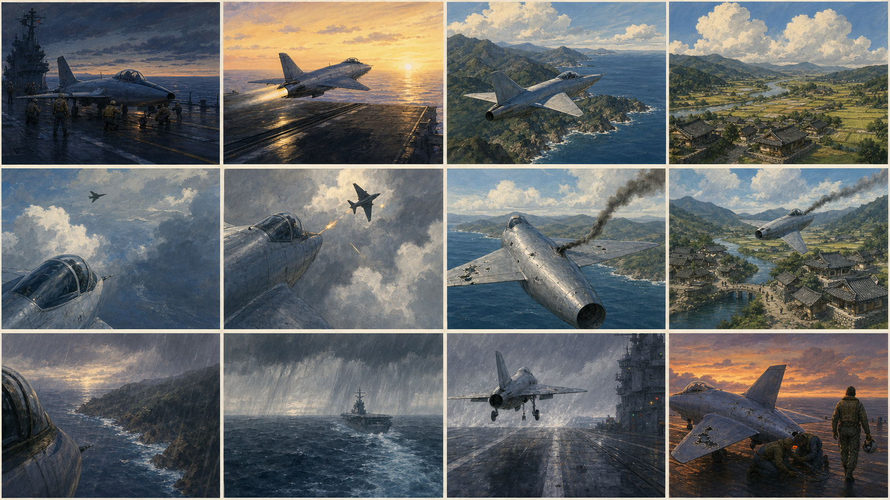
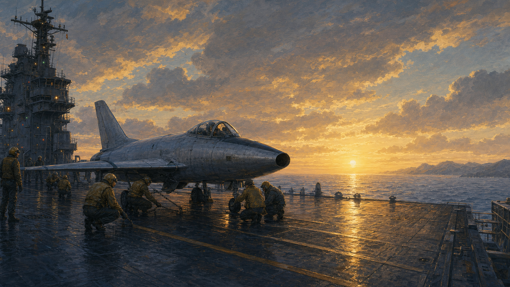
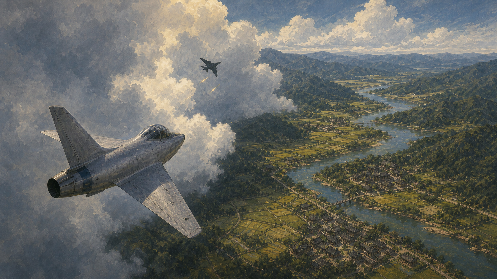
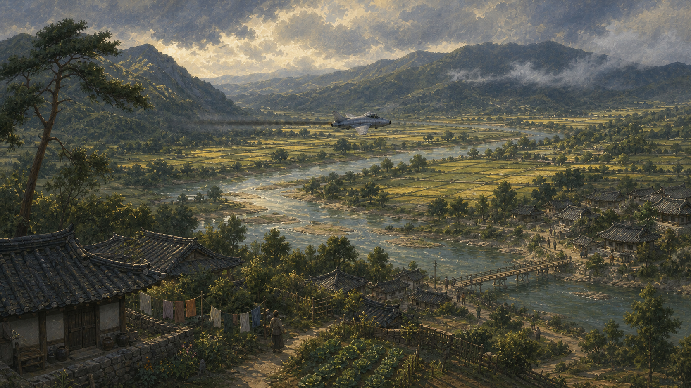
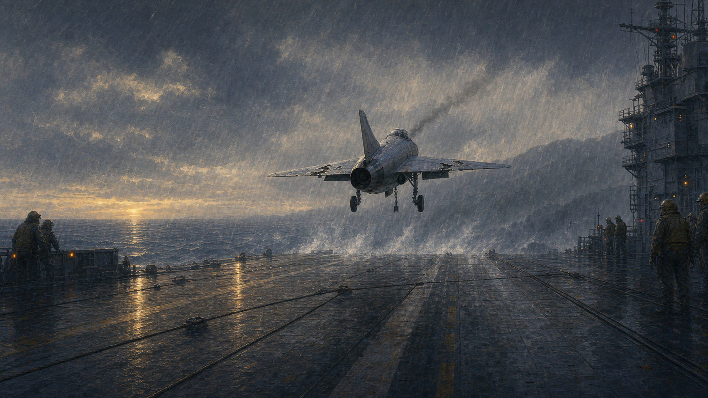

# Korea 1950s — The Long Way Home: September 1951

Status: historical narrative reframe; exploratory palette lock retained  
Date: 2026-07-30  
Epistemic status: **fixed-history Armstrong reconstruction in research; retained v1 art is fiction**  
Runtime scope: presentation layer only; no simulation-authority or HUD-truth changes

The active narrative and production scaffold is
[`narrative/README.md`](narrative/README.md). Its first filled contract is
[`narrative/armstrong-ejection.sequence.json`](narrative/armstrong-ejection.sequence.json).

## Thesis

The Korea flashback reconstructs Neil Armstrong's September 1951 Panther cable strike as a linear
playable mission: launch from USS *Essex*, follow Major John Carpenter through the low-level
armed-reconnaissance run, strike a physical cable, control the damaged aircraft south, decide
against landing, eject and recover on friendly ground.

The plot is fixed history. Player performance remains simulated. The mission owns the invariant
sequence; the player owns the quality of the launch, route, attack, emergency control, formation,
ejection procedure and survival. Plot-breaking divergence restores the nearest checkpoint rather
than creating an alternate Armstrong biography.

Flight can be exhilarating; war remains an intrusion. The world is warm, soft and visibly
handmade. The Panther, deck equipment and cockpit instruments remain mechanically legible and
honest. Character and dialogue follow the record and operational necessity, not an invented moral
surrogate.

The user's “Miyazaki film” phrase is a tonal shorthand, not a copying instruction. Production uses
an original hand-painted mid-century animation language: gouache backgrounds, soft cel forms,
expressive weather, quiet aftermath, human-scale landscape and affection for imperfect machinery.
It does not reproduce a named studio's characters, props, compositions or film frames.

This is a Korea theatre profile. It must not become the engine default, and it must not leak into
Ukraine or another theatre.

## Exploratory palette lock

The retained v1 images predate the Armstrong decision. They depict a fictional swept-wing fighter,
opponent, combat damage and carrier recovery. They remain useful for palette, atmosphere, landscape
scale, restrained effects and weather contrast only.

They are **not** evidence for Armstrong's appearance, the F9F Panther, USS *Essex*, the target run,
the cable strike, damaged-flight geometry, ejection or ground recovery. New sourced reference boards
will replace them for those purposes without deleting this early exploration.

### Continuity board

### Hero targets

The five images are art-direction evidence, not runtime textures. They were generated through the
built-in ImageGen workflow, saved into the repository, and reviewed for subject, continuity,
composition, period cues and prohibited elements. The exact retained prompt set is in
[`reference/PROMPTS.md`](reference/PROMPTS.md).

## Narrative spine

Working title: **The Long Way Home: September 1951**

| Beat | Playable purpose | Truth status before dossier lock |
|---|---|---|
| 1. *Essex* | Exposed checks and straight-deck launch | Historical setting; procedure reconstruction |
| 2. Join | Take position on Carpenter's wing and cross the coast | Carpenter historical; exact route reconstruction |
| 3. Into the valley | Descend into the inland target corridor | Target region historical; route reconstruction |
| 4. Armed reconnaissance | Complete the required target run | Mission type historical; detailed run unresolved |
| 5. The cable | Physical cable collision removes right-wing structure | Strike and wing loss historical; layout reconstruction |
| 6. Hold it | Arrest the roll and establish damaged control | Engineering reconstruction |
| 7. No landing | Hold inspection formation and receive the ejection decision | Decision historical; exact exchange unresolved |
| 8. South | Carry the Panther into friendly territory | Historical with route details unresolved |
| 9. Prepare | Establish the disposal and ejection envelope | Procedure reconstruction pending handbook |
| 10. Punch out | Execute seat, pilot and aircraft separation | Historical event; physics pending technical source |
| 11. Back over land | Descend under parachute and reach friendly ground | Historical outline; exact landing unresolved |
| 12. Recovery | End at human scale and enter the evidence-backed debrief | Recovery details unresolved |

All twelve beats are required for progression. The cable strike is not a branch. The authored task
and corridor carry the player into physical wire geometry; collision and damage remain simulation
facts. Leaving the story path restores a checkpoint.

## Visual grammar

### Shape

- Aircraft: compact, visibly maintained but weathered, unmistakable straight-wing F9F Panther
  silhouette after subtype lock.
- Cloud: very large, soft-edged masses with readable lit and shadow planes.
- Terrain: broad value-separated ridges; cultivation reads as a regional rhythm, not tile noise.
- Village: low roof clusters embedded in landform; never a dense city carpet.
- Trees: grouped rounded masses with occasional wind-bent silhouette trees.
- Effects: restrained ordnance, violent but brief cable contact, detached wing structure and thin
  persistent damage trace; no celebratory fireballs.
- Deck: strong perspective, wet matte surfaces, repeated human-scale equipment.

### Surface

- Gouache-like value blocks and subtle dry-brush modulation.
- Soft PBR break rather than black ink outlines.
- Aluminium stays metal: broad cool values, small warm reflections, restrained roughness variation.
- Wet deck and river specular are narrow compositional accents, not a glossy full-frame treatment.
- Paper grain belongs to reference art; runtime reproduces its value structure, not literal grain.

### Camera

- Let landscape or weather occupy at least half the frame in establishing shots.
- Keep Panther, Carpenter's aircraft, cable and separated pilot silhouette readable at their
  operational distances.
- Avoid heroic low-angle poster framing during weapon use.
- Use cockpit-adjacent and external directed shots only outside flight-control-critical interaction.
- Preserve spatial continuity through ejection and end on a held quiet recovery frame.

## Color script

The following tokens are the first engine values to tune. They are deliberately compact so a
screenshot review can discuss concrete colors rather than “more Ghibli.”

| Token | Golden departure | Mountain encounter | Quiet valley | Rain recovery |
|---|---|---|---|---|
| Zenith / storm sky | `#6F8492` | `#6E8DA5` | `#687887` | `#505B66` |
| Horizon / light break | `#F3D08C` | `#E9D8B3` | `#D8BE82` | `#C89451` |
| Cloud light | `#F4E7C9` | `#F3E9D3` | `#E9DDC2` | `#C7CBC8` |
| Cloud shadow | `#78838B` | `#697986` | `#727A78` | `#59616A` |
| Ridge / foliage | `#394A3A` | `#344B32` | `#30452F` | `#34403D` |
| Field / straw | `#A89858` | `#AAA05A` | `#B1A15A` | `#77745D` |
| River / sea | `#274D5D` | `#6F9798` | `#719A98` | `#183241` |
| Roof / deck | `#2B3031` | `#4B443A` | `#403A32` | `#292E31` |
| Aluminium | `#899399` | `#8D9699` | `#8A9291` | `#858D91` |
| Amber accent | `#DEA34F` | `#D7B06B` | `#C99A58` | `#D39A50` |

Rules:

- Gold is confined to light breaks, reflections and tiny lamps. It is not a sepia filter.
- Rain never collapses the aircraft into the sky; silhouette contrast is a flight-readability
  invariant.
- Terrain distance converges by value and haze, not by exposing streamed squares.
- Village roofs remain darker than adjacent fields and lighter than the deepest tree masses.

## Engine translation contract

| Reference evidence | Runtime owner | First implementation |
|---|---|---|
| Gold dawn, cloud cream, shadow slate | Korea pack atmosphere | Pack-authored sky and cloud palette |
| Indigo-to-jade water, restrained glint | Korea pack ocean | Ocean material colors and rougher sun glint |
| Ridge value separation and warm field rhythm | Terrain material | Korea-1950s palette branch and haze values |
| Rounded grouped vegetation | Scenery profile | Korea-1950s soft canopy with period density |
| Dark embedded tiled roofs | Scenery profile | Period roof/building palette and low clusters |
| Readable lead aircraft and cable line | Visual profile | Preserve formation/cable visibility without moving truth |
| Cable contact and persistent wing damage | Effects profile | Bind restrained effects to authoritative collision/damage |
| Essex → valley → damaged return → descent | Narrative presentation | Versioned visual-state/color-script selector |
| Carrier wet-deck perspective | Carrier presentation | 1951 Essex lighting/material pass; no geometry truth changes |

### Data ownership

- Authored palette and atmosphere values belong under `content/packs/korea-1950s/`.
- The staged web pack remains byte-for-byte synchronized through the asset staging tool.
- Shared renderer code may expose generic controls, but must not contain the story title or silently
  select Korea.
- Korea-specific environment activation must be a declared pack capability, not an ID branch.
- AI references remain under `docs/art-direction/korea-1950s/reference/` and are never fetched by
  production.

## Vertical-slice acceptance

The slice is not accepted because individual assets look attractive. It is accepted when four
runtime captures apply the retained palette grammar to the sourced Armstrong sequence:

1. **Essex launch:** warm light break, deep wet deck, enormous sky and readable Panther metal.
2. **Cable corridor:** value-separated ridges, target workload and physical cables visible without
   a game-highlight outline in the default presentation.
3. **Damaged southbound:** Carpenter in inspection position, missing right-wing structure and a
   readable asymmetric attitude over inhabited terrain.
4. **Ejection and descent:** coherent aircraft/seat/pilot separation followed by exposed human
   scale beneath a parachute.

All four must retain:

- projectively true HUD and flight cues;
- no simulation-state changes from presentation;
- the 60 fps contract and its telemetry;
- deterministic fallback when the pack environment cannot load;
- no Ukraine visual regression;
- no generated reference image in the runtime network closure.

## Expansion order

1. Finish the governed source dossier and subtype/route decisions.
2. Greybox all twelve fixed-history beats with checkpoints.
3. Lock Panther, Essex, cable, damage, ejection and recovery reference boards.
4. Apply atmosphere, terrain, scenery, material and restrained-effects passes.
5. Generate and integrate the sourced radio catalog and full sound design.
6. Pass historical, rights, accessibility, deterministic replay and performance gates.
