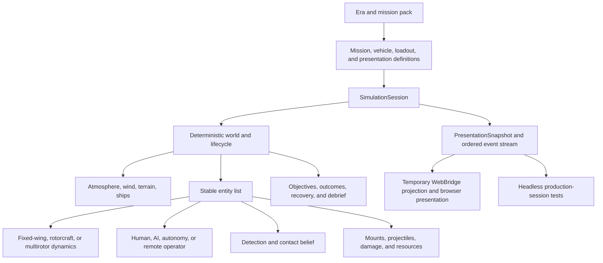

# Guns Only platform architecture

Status: active direction, 2026-07-19

## Product boundary

Guns Only is a close-range air-combat and maintenance-test-flight platform, not one aircraft
stretched across every era. Its campaign spine is one Korean battlespace viewed in two periods:
the historical 1950s war and an explicitly fictional, alternate-history 2030s conflict. Its common
identity is the engagement model:

- Position, energy, visibility, ammunition, damage, and survival are authoritative.
- Controls remove repetitive motor workload without choosing tactics for the player.
- AI and humans obey the same vehicle, weapon, sensor, and environment rules.
- An engagement is part of a complete sortie with an explicit start and outcome.

Era and vehicle packs change the available technology. A 1950s naval fighter, an early helicopter,
a modern fixed-wing drone, and a multirotor can share a world without sharing fake flight dynamics,
control inputs, sensors, or presentation.

The 2030s premise is a US--China proxy war on the Korean peninsula following a fictional rapid
fait accompli in Taiwan: the wider war never ignites, outside powers accept the immediate outcome,
and the unresolved strategic contest moves elsewhere. That event is a declared timeline divergence,
not a forecast or a claim about the real world. Campaign structure can intercut sorties across eras
so terrain, weather, tactical problems, and human decisions rhyme without making either era a
cosmetic reskin.

The source-backed fact/fiction boundary and setting options live in
[`world-backstory-research.md`](world-backstory-research.md); implementation documents should not
promote one of its proposed fictional dates or organizations to canon accidentally.

## Campaign governance boundary

Campaign authorship is a governed input to the platform, not presentation copy wrapped around a
mission index. [`content-governance.md`](content-governance.md) defines the active authoring contract,
and `content/governance/` contains machine-readable policy and mission dossiers.

The governance layer owns:

- which revelations and cross-era echoes are authored rather than randomized;
- the separation between historical claims, engineering claims, reconstruction, and fiction;
- learning objectives that move from experienced consequence to debrief explanation to later
  application;
- allowed permanent unlocks and forbidden physical or informational buffs;
- attrition fairness and readiness-resource vocabulary;
- representation, evidence, simulation-integrity, production, and approval gates.

It does not advance physics, adjudicate outcomes, or mutate an aircraft. A future run director reads
approved stable IDs and chooses a mission contract, seed, route state, and readiness state. The
`SimulationSession` produces the authoritative sortie outcome. Campaign code consumes that outcome
through a versioned result adapter; it cannot override projectile, damage, recovery, sensor, or
grading truth.

```text
campaign governance -> approved mission dossier -> run director -> mission contract
    -> SimulationSession -> ordered outcome evidence -> debrief/profile progression
```

The normal repository gate validates dossier schema, timeline closure, references, evidence closure,
educational transfer, progression allowlists, and blocking reviews. Human reviewers retain authority
over historical interpretation, dramatic quality, learning usefulness, and respectful portrayal.

The browser is the canonical product shell. The retired desktop shell is not a compatibility target.

## Future domain boundary

Aviation is the first proving domain, not the final reason for the work. The reusable substrate is a
decision simulation in which world truth is partially observable, equipment and people have state,
procedures constrain safe action, resources and time are finite, handoffs can lose information, and
a debrief can reconstruct what evidence was available when a decision was made. Those primitives
can later support casualty evacuation, medical-drone dispatch, austere logistics, and clinical-team
training without making a medical scenario pretend to be an aircraft mission.

Do not extract a generic framework merely because two domains share vocabulary. First prove these
contracts in aviation: deterministic truth, observer-specific evidence, semantic actions, procedure
gates, degradable components, ordered events, and evidence-based scoring. A later medical domain
must supply its own validated physiology, equipment, roles, protocols, uncertainty model, and
subject-matter review. Training behavior must remain explicitly separate from clinical decision
support unless a future product undertakes the validation and governance required for that use.

## Platform invariants

The following properties belong below all content packs:

1. Float64 authoritative state and quaternion attitude.
2. A deterministic fixed 120 Hz simulation tick.
3. No renderer, browser, or device types in the simulation assembly.
4. Seeded environment and AI variation with no wall-clock decisions in a tick.
5. Stable entity identifiers and versioned state/event contracts.
6. One production lifecycle used by the browser and headless tests.
7. Contacts are sensor beliefs; exact transforms are private world state.
8. Resources and damage survive for the lifetime defined by the mission ruleset.

## Runtime shape



`SimulationSession` is the authority for staging, Ready/Active/Paused/Finished state, the fixed-step
accumulator, mission transitions, controls, combat, resources, recovery, and outcomes. The first
implementation wraps the existing one-player/one-bandit carrier loop. It is a migration seam, not
the final entity abstraction.

As the platform grows, the session should contain a `SimulationWorld` responsible for N entities.
The session remains the public lifecycle API and owns mission-level state around that world.

Do not introduce a general-purpose ECS until the deterministic entity list and focused interfaces
demonstrably fail. This project needs explicit simulation phases more than a framework.

## Authoritative tick

Every fixed tick runs in a documented order:

1. Accept already-timestamped semantic commands for this tick.
2. Update sensors and controller belief state.
3. Let human control laws, AI, and autonomy produce actuator demands.
4. Sample the shared environment and calculate forces and moments.
5. Integrate vehicle and moving-platform states.
6. Advance weapon mounts and projectiles; resolve swept contacts.
7. Apply damage, fuel, ammunition, engine, and crew/system effects.
8. Evaluate objectives, recovery state, transitions, and outcomes.
9. Emit ordered events and make an immutable presentation snapshot available.

Presentation interpolation occurs after the snapshot and never feeds authoritative state.

## Entities and controllers

An entity has a stable ID, transform, lifecycle state, definition ID, and a small set of explicit
capabilities. Aircraft add dynamics, control, resources, sensors, weapon mounts, contact geometry,
damage state, and a controller.

Controllers are not vehicle types:

- A human controller consumes semantic intent from the browser.
- A tactical AI consumes only its belief state and doctrine configuration.
- An autonomous drone controller combines mission intent, sensor belief, and vehicle limits.
- A remote operator adds latency, packet loss, and datalink state before semantic intent arrives.

The same fixed-wing definition can therefore be crewed, autonomous, or remotely controlled without
forking its aerodynamics.

Replace the bandit-specific abstraction with a general controller interface as soon as the second
independent combatant can fire. Avoid exposing exact opposing `AircraftState` objects to controllers.

## Vehicle definitions and dynamics

A data-backed `VehicleDefinition` should identify:

- Mass properties, centre-of-gravity range, and inertia.
- Dynamics provider and its validated parameter set.
- Propulsion, transmission, fuel stores, and performance limits.
- Actuators, stability augmentation, and control-law profile.
- Sensor and datalink capabilities.
- Weapon mounts, ammunition stores, and convergence/dispersion.
- Gear, skids, hook, contact points, and structural limits.
- Collision and damage volumes.
- Asset, camera, HUD, input, audio, and effects profile IDs.

Definitions are immutable content. Fuel, damage, ammunition, temperature, rotor RPM, and actuator
state belong to an entity instance.

### Fixed-wing

The existing `AircraftSim` and reduced-order F-86 model become the first `FixedWingDynamics`
provider. Preserve its rigid-body state, RK4 integration, atmosphere, wind-relative forces, and
performance calibration while progressively improving:

- Authoritative airspeed and dynamic pressure for all flight-control consumers.
- Dynamic-pressure-dependent control authority.
- Table-backed lift, drag, moment, and propulsion where a vehicle requires it.
- Natural stall/departure behaviour instead of hard state projection.
- Mass, centre-of-gravity, and inertia changes as stores and fuel change.

A fixed-wing drone normally reuses this provider. Its differences are most often controller,
actuation, sensors, datalink, damage tolerance, and presentation—not a special category of physics.

### Rotorcraft

Rotorcraft require a sibling `RotorcraftDynamics` provider. They must not be implemented by tuning
the fixed-wing speed clamps or mapping collective onto G demand.

The first useful helicopter model needs:

- Main-rotor thrust, torque, induced inflow, flapping response, and rotor RPM.
- Engine, governor, transmission, and available-power limits.
- Cyclic, collective, pedal, and tail-rotor authority.
- Translational lift, ground effect, fuselage/tail drag, and wind response in hover.
- Retreating-blade/Vne behaviour.
- Autorotation and vortex-ring state at an explicitly chosen fidelity.
- Multiple skid/wheel contacts, rotor clearance, and rotor-strike damage.
- Ship airwake and a wind field that can vary with both position and time.

Initial validation cards are hover power, hover control response, climb power, transition through
effective translational lift, forward speed/Vne, ground effect, engine-out autorotation, and landing
contact loads. Combat content comes after these cards are credible.

### Multirotor

A later multirotor provider can share the rigid-body integrator and environment but needs individual
rotor thrust/torque allocation, motor response, battery/power state, flight-controller limits, and
failure modes. It should enter only after the entity and vehicle-provider seams have been proved by
a second fixed-wing family.

## Semantic controls

`PilotCommand(GDemand, BankTarget, Throttle, Rudder)` is fixed-wing-specific. The browser should
produce semantic intent rather than pretend every vehicle has the same cockpit controls.

Examples:

- Fixed-wing: lift-vector direction, normal-acceleration demand, energy/throttle intent, yaw trim.
- Helicopter: attitude or horizontal-velocity intent, climb/collective intent, heading/yaw intent.
- Multirotor: horizontal acceleration/velocity, vertical velocity, heading, mode intent.

Each vehicle control law maps semantic intent to actuators while enforcing its augmentation and
damage state. Input profiles map keyboard, touch, tilt, gamepad, or future hardware to the same
semantic layer.

The tactical decisions should remain stable across devices; actuator behaviour remains specific to
the vehicle.

## Sensors and contact belief

World truth is available to physics and hit resolution only. Each observer receives contacts such
as:

```text
observerId, contactId, classification, quality, lastSeenTick,
estimatedPosition, estimatedVelocity, uncertainty, source, visibilityState
```

Visual tally, optical sensors, radar, infrared systems, datalinks, terrain masking, clouds, aspect,
range, field of view, and damage update that belief. Cameras, HUDs, padlock, AI, and autonomy consume
the belief state rather than an opponent transform.

Historical packs can have sparse visual contacts and manual tally. Modern packs can have fused
contacts, but fusion quality, update rate, latency, emissions, and datalink failure remain part of
the game. Modern capability must not become omniscience.

## Shared Korean environment

Both eras use the same georeferenced terrain substrate and coordinate reference. The terrain source
owns elevation, land/water classification, surface normal, and line-of-sight obstruction. An era
overlay owns dated airfields, roads, settlements, vegetation policy, fortifications, emitters,
navigation aids, and damage state. This prevents two nearly identical Koreas drifting apart while
still allowing the 1950s and fictional 2030s surface worlds to be materially different.

The first acquisition crop, source/licence matrix, vertical reference, provenance records, and QA
gates are defined in [`korea-environment-data-sources.md`](korea-environment-data-sources.md). Raw
archives remain build inputs; runtime chunks must carry reproducible lineage and generated notices.

Meteorological truth is independent of the renderer. A scenario weather profile supplies a
hydrostatic temperature/pressure column, three-dimensional mean wind, shear and turbulence,
cloud/precipitation volumes, convective cells, visibility, and relevant hazards. Flight physics,
pitot/static air data, propulsion, sensors, weapons, icing, and terrain clearance sample that truth.
The renderer may use inexpensive layered or impostor clouds, but it must depict enough of the same
state for a pilot or operator to make the decision the simulation expects.

Clouds are not scenery in either era. In the 1950s they break visual tally, obscure terrain and the
boat, create icing, precipitation, turbulence, and recovery decisions. In the 2030s they also
degrade electro-optical and infrared paths, alter laser and RF propagation where the sensor model
supports it, and create opportunities for masking or datalink loss. Convective cells add vertical
motion, gusts, heavy precipitation, lightning risk, and avoidance decisions; they are bounded,
deterministic weather entities rather than random screen effects.

## Weapons, damage, and resources

Move from one player-owned gun object to generic weapon mounts:

- Definition: weapon ID, mount transform, muzzle velocity, cadence, dispersion, ammunition type,
  convergence, heat/reliability, and permitted firing state.
- Instance: remaining rounds, firing accumulator, temperature, damage, and rounds in flight.
- Projectile: owner, launch tick, inherited velocity, drag/gravity model, lifetime, and damage data.

Swept collision remains authoritative. Replace the single target sphere and hit-count kill with
vehicle damage volumes and effects on propulsion, controls, sensors, crew/autonomy, fuel, structure,
and fire. Damage does not need to be microscopically simulated, but tactical consequences should be
legible and persistent.

Mission rules decide when fuel, ammunition, damage, and aircraft inventory reset. Continuous carrier
operations preserve them across trap and relaunch unless an explicit service event occurs.

## Missions and content packs

A data-backed `MissionDefinition` should contain:

- Stable ID, schema version, era, theatre, ruleset, and seed.
- Environment, time, weather, terrain, and moving platforms.
- Entity definitions, spawn state, controller, coalition, loadout, and presentation profile.
- Objectives, constraints, recovery/service rules, outcomes, and debrief measures.

Suggested rulesets are `training_drill`, `discrete_sortie`, and `continuous_operations`.

Initial packs:

1. **Korea 1950s:** the existing Sabre/Fury-class energy fight, maintenance test flying,
   straight-deck recovery, and early rotorcraft operations.
2. **Korea 2030s (alternate history):** US--China proxy warfare built around fixed-wing drones,
   attritable multirotors, sensor/datalink doctrine, contested electromagnetic spectrum, and no
   information cheating.
3. **Early rotorcraft:** a vehicle family within the 1950s pack, emphasizing power margin,
   terrain/ship masking, low-altitude gunnery, casualty evacuation, and difficult recovery.

Content selects definitions and policies. It must not add era checks to the core tick or renderer.

## State, events, telemetry, and replay

Keep three contracts structurally distinct:

1. **World truth** for physics, effects, and adjudication.
2. **Observer evidence** containing only what a particular crew, operator, maintainer, sensor, or
   automation process could know at that tick.
3. **Debrief truth** which may correlate hidden state and observations after the exercise, while
   preserving exactly what evidence was available when each action occurred.

The learner-facing bridge must not receive hidden truth and rely on UI convention to conceal it.
This boundary is as important for a failed gear indication as it will be for a later casualty,
medical-drone, or team-handoff scenario.

The browser boundary should expose a versioned DTO rather than hand-built shell-specific state.
Snapshots include schema version, build/content hashes, tick, lifecycle, stable entity IDs, public
kinematics, contacts, resources, damage summaries, objectives, cues, and presentation profile IDs.

`WebBridge` is currently a temporary flat transport projection for the existing JavaScript shell.
It is not the public domain model. Gameplay authority moves into `SimulationSession`; the transport
then projects a `PresentationSnapshot` plus ordered events without recreating rules or exposing
mutable simulation objects.

Ordered events capture inputs and discrete outcomes such as trigger edges, shots, hits, damage,
contact changes, objective transitions, trap/bolter/catapult events, spawns, despawns, and debrief.

Add a lossless, tick-keyed audit journal alongside presentation events and lossy product telemetry.
Journal records need actor, observer and affected-entity IDs; semantic action and origin (learner,
automation, instructor, or UI safety release); mission/model/content versions; seed set; and periodic
state hashes. Procedure evaluation consumes observer evidence and semantic actions from this journal,
not direct access to live failure state. Its rich result remains separate from the compressed tactical
outcome: a lucky recovery can still contain unsafe reasoning, while a safe abort can be correct.

A replay records:

- Initial mission definition and content hashes.
- Simulation version and seed set.
- Semantic input/event stream by tick.
- Periodic state hashes for divergence detection.

Telemetry may be lossy and batched; replay data may not. The recorder needs retry/single-flight
delivery if the project promises every sortie is retained.

## Multiplayer authority seam

The current global room is a deliberately narrow presence service. Its Durable Object owns the
world epoch, stable browser identities, callsigns, sector allocation, server time, connection
lifecycle, and deterministic world-bogey trajectories. A client contributes its own aircraft pose;
the room validates and normalises that report, but it does not make the browser authoritative for
hits, damage, fuel, objectives, sensors, or another player's outcome.

Protocol-v2 pose reports carry a stable pilot identity plus an optional per-sortie entity ID. They
also distinguish combat viability (`alive`) from physical existence (`bodyPresent`) and carry the
terminal lifecycle state. That distinction keeps a destroyed aircraft visible while terminal
physics takes it through impact and settling, while the per-sortie ID makes a respawn an explicit
discontinuity instead of interpolating between unrelated airframes. Active and terminal-motion
states publish at 20 Hz; Ready, Paused, and Finished states need only a one-hertz heartbeat, with
lifecycle transitions sent immediately.

The coordinate contract is explicit: simulation and wire data use X east, Y up, Z north. The room
adds the assigned sector origin and each client subtracts its own origin. Only the renderer converts
the result to its handedness by negating Z. No transport or simulation layer may perform that visual
conversion.

Shared players and world bogeys remain presentation-only. They are excluded from local contact
belief, HUD targeting, padlock, collision, weapons, scoring, and sortie outcomes. Historical replay
also hides current room traffic: recorded incident truth and live presence are different timelines
and must never be composited as if they were simultaneous.

The next combat slice must introduce server-owned combat entity IDs and lifecycle, bounded pose
history, server projectile/hit adjudication (or a rigorously validated shot-claim protocol), and an
observer-specific contact projection. Raw shared transforms must never be promoted directly into
targetable contacts; doing so would both leak hidden world truth and make a browser-reported pose a
combat cheat surface. Authenticated accounts can later own browser identities without changing this
world-truth / observer-evidence boundary.

## Web presentation

Presentation is a parallel pipeline behind the snapshot/event contract. Content-pack manifests
select visual profiles, and the browser resolves profile and asset IDs through registries:

- Asset factory and effects profile.
- Camera profile and allowed tracking modes.
- Composable HUD widgets and sensor displays.
- Input and accessibility profile.
- Audio and warning profile.

Korea 1950s, Korea 2030s, and rotorcraft profiles should remain distinct without placing era
conditionals in the gameplay session. The presentation pipeline owns the concrete renderer and asset
implementation; this gameplay architecture reserves only the versioned IDs, capabilities, and
events it needs.

Do not choose models by mission-name strings or assume a fixed player, bandit, carrier, and AWACS.
The renderer iterates the snapshot's entities and contacts. HUD composition follows capabilities:
a 1950s sight, a helicopter instrument set, and a modern drone operator display should not be skins
over one universal glass cockpit.

Briefing, calibration, help, and debrief are lifecycle states. They must explicitly hold or pause
the authoritative session.

## Migration sequence

1. **One production session:** route the existing web game and headless carrier outcome test through
   `SimulationSession`; remove duplicated orchestration.
2. **One honest mutual fight:** enemy weapons, player damage, persistent resources, shared wind, and
   sensor belief for both sides.
3. **N-entity world:** stable IDs, entity/controller interfaces, generic mounts, versioned snapshots,
   and data-backed mission/vehicle definitions.
4. **Second fixed-wing family:** use a Korea-2030s fixed-wing drone to prove controller, sensor, asset,
   camera, HUD, and content seams before adding another dynamics provider.
5. **Fixed-wing edge fidelity:** airspeed consistency, dynamic-pressure controls, stalls/departures,
   tables where evidence supports them, and mass-property changes.
6. **Rotorcraft provider:** implement and gate helicopter test cards before combat scenarios.
7. **Broaden packs:** add content only when a new vehicle or mission is primarily definitions,
   validated parameters, and assets rather than shell conditionals.

## Verification gate

`bin/check` is the minimum repository gate: JavaScript syntax, solution build, .NET tests, and a
release web publish. Continuous integration should call that command.

Additional platform gates should include:

- Headless tests against the production `SimulationSession`, never a copied game loop.
- Mission and vehicle schema validation.
- Per-vehicle performance cards with explicit tolerances and sources.
- Mutual-combat, damage, resource, sensor-loss, recovery, and lifecycle scenarios.
- Deterministic replay/state-hash checks on the supported runtime.
- Browser smoke tests for desktop and mobile Ready, controls, firing, pause, carrier lifecycle, and
  debrief.

Headline fidelity claims are gated only when the corresponding card has a real tolerance. A
report-only calibration test is useful evidence, but it is not an independent acceptance criterion.

## Explicit non-goals

- Reintroducing a second presentation shell before the browser/session boundary is proven.
- One universal aerodynamic model for every aircraft.
- Full cockpit switch simulation as a prerequisite for tactical play.
- A broad ECS or plugin framework before two real vehicle families require it.
- Perfect system-level damage before mutual combat has readable consequences.
- Modern sensors that expose world truth merely because the technology is newer.
