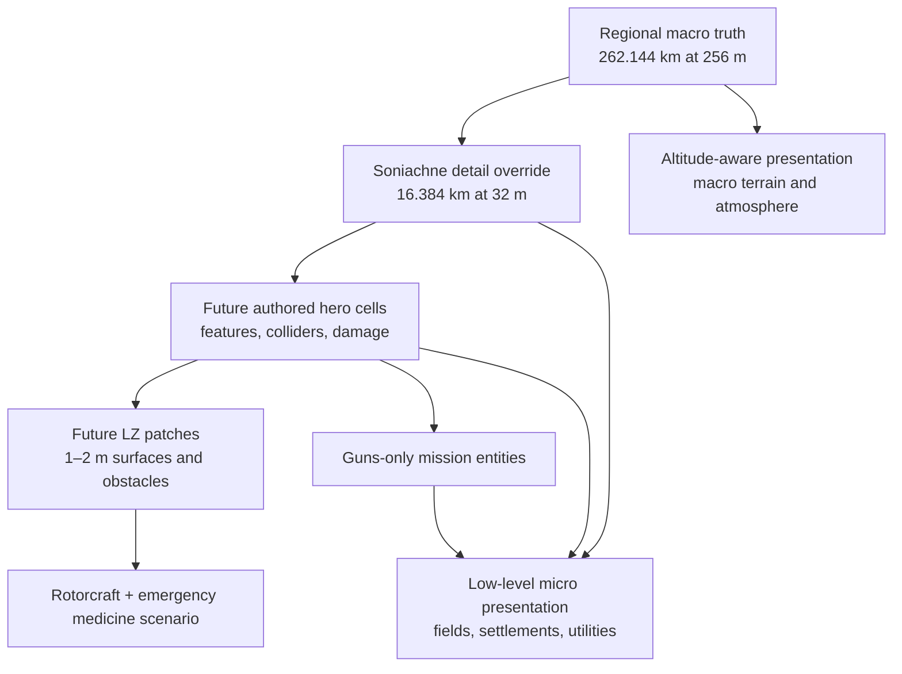

# Fictional Ukraine 2030s theatre and medevac foundation

## Decision

Use one synthetic 2030s Ukraine theatre for the whole programme. Aircraft and mission content may
change, but regional flight, the Soniachne low-level cell, the coastal recovery cell, and the fixed
Rapier strip all publish the same theatre, world-frame, and terrain identity. They are nested
fidelity bands or mission-local instances, not separate settings.

The terrain is metre-scale synthetic content, not a reskin of Korea or a derivation from current
war geography. It carries no real coordinates, formations, bases, or operational claims.

The first low-level slice is mission 8, **Low-Level Drone Intercept**: an F-22 public-data
surrogate intercepts four sequential fictional airborne raiders over the Soniachne detail cell.
The regional slice also supports the Rapier's fixed-strip launch, climb, guns-only intercept, and
hook recovery. Neither mission is a player-controlled attack drone or a ground-attack mission yet.

## World layers

The renderer can decorate authoritative data, but it cannot invent gameplay facts. A procedural
house may look good and still be only ambient scenery. It becomes targetable, collidable or usable
as medical cover only after a stable feature entity exists in simulation truth.

## Current terrain contract

- Theatre extent: geodetic **rapier-range** atlas on real Copernicus DEM (`33.0–38.4°E`,
  `46.6–50.2°N`, ~393 km class), sized for jet range. Fictional eastern strip at reference origin
  `38.0°E`, `48.5°N`. Country-scale D2 envelope is declared in the Ukraine source lock for expansion.
- Streamed truth: schema-v2 range-addressable atlas pages (32 m finest LOD); Copernicus water mask
  supplies coast / lake / river classification.
- Legacy synthetic Soniachne (`soniachne-steppe.*`) remains on disk for comparison but is not the
  Rapier / environment-lab default.
- Nested authority: atlas DEM is flight-continuity and visual truth for regional sorties. Future
  finer hero / LZ patches can override locally without inventing a second theatre.
- Rendering: macro/atlas terrain is required. Ambient micro scenery uses `ukraine-modern` and may
  shed at high altitude with hysteresis.
- Mission placement: Rapier corridor and other missions are local instances on this geodetic frame;
  they reject the multiplayer room origin until protocol v3.

The atlas layer is flight-continuity truth, not landing-zone truth. Authored 1–2 m hero cells are
still required before rotorcraft LZ validation.

Sharing a physical theatre identity does not currently mean sharing one live flight instance.
Presence protocol v2 does not attach authoritative world-frame and mission-instance identity to
every remote contact, and its sector assignment is unaware of this terrain product's finite bounds.
The browser therefore suppresses remote aircraft and bogeys in all current Ukraine missions while
retaining room connection/count status. Multiplayer scene sharing remains gated on protocol v3:
frame and instance identity on each contact, terrain-aware assignment, and verified agreement
between simulation sampling and rendered placement.

## Implemented mission cells

- **Regional frame:** the common synthetic substrate and macro visual for the 2030s programme.
- **Soniachne detail cell:** mandatory nearby micro scenery for the low-level drone intercept.
- **Coastal cell:** a mission-local land/sea instance for recovery sorties in the same theatre.
- **Rapier corridor:** a mission-local regional instance with a stationary fictional
  catapult-and-arresting strip. The platform is fixed in simulation and presentation and does not
  inherit ship motion, maritime wind effects, hull, or island geometry.

All current combat in this theatre is guns-only. There are no bombs, missiles, renderer-owned
ground kills, or real-world target locations.

## Art direction

Use the Ghibli-adjacent soft-world / cold-instruments language from
[ADR-0003](adr-0003-ghibli-adjacent-world-presentation.md) and [art-direction.md](art-direction.md):
painterly light, warm cultivated lowlands, dark shelterbelts, soft atmospheric distance, and
strong silhouettes for safety. Instruments stay clinical. Do not copy Studio Ghibli or Valve
characters, textures or props.

The regional grammar is:

- large rectangular agricultural fields rather than Korean valley terraces;
- long shelterbelts and sparse tree groups;
- linear villages, farm compounds and occasional apartment blocks;
- roads, rail and power lines that persist across tile boundaries;
- red, grey and muted blue roofs;
- low rolling steppe with broad drainage and modest eastern relief.

Ambient buildings carry stable IDs plus `role: "ambient"` and `targetable: false`. Macro terrain
cannot be shed. Soniachne micro scenery is required for the low-level mission; elsewhere the
altitude-aware renderer may omit ambient micro density when it contributes no usable visual
reference. Mission entities and future LZ obstacles remain essential layers.

## Next combat slice

Implement these in order:

1. Add an authoritative feature-pack schema with stable IDs, footprint/collider, affiliation,
   damage state, targetability, occlusion class and presentation binding.
2. Author one 4 km × 4 km hero cell inside the preserved Soniachne detail cell: village edge, road,
   treeline, power line, bridge/culvert and two clearly fictional enemy emplacements.
3. Add a player-controlled fictional gun UCAV using a public, reduced-order aerodynamic model.
4. Add a ground-entity target adapter to the existing gun projectile/damage authority. Do not make
   decorative building instances hittable by raycast.
5. Stage one short attack route with safe boundaries, civilian exclusion zones and explicit
   guns-only loadout. No bombs, missiles or real-world coordinates.
6. Add authored damaged/destroyed visual states, dust, tracers and impact evidence driven only by
   simulation events.

This produces the requested drone-on-soft-world-enemy mission without creating a renderer-only
shooting gallery, a second Ukraine theatre, or contaminated medical truth.

## Medium-term integrated roadmap

| milestone | playable result | new authority |
|---|---|---|
| 1. Regional foundation | guns-only sorties share one 262.144 km theatre | 256 m macro truth, nested 32 m detail, AGL, weather, streaming |
| 2. Fixed-strip sortie | Rapier launches and recovers from a stationary fictional strip | fixed platform truth, regional route, altitude-aware presentation |
| 3. Gun-UCAV hero cell | player attacks fictional emplacements in one authored 4 km cell | feature IDs, colliders, damage, exclusion zones |
| 4. Medevac LZ stage | reconnaissance and LZ assessment in the same hero-cell system | 1–2 m surfaces, obstacles, corridors, access and LZ status |
| 5. Rotorcraft flight model | approach, hover, landing and departure constrained by conditions | mass/CG, rotor/engine maps, wind, density altitude and power margin |
| 6. Emergency-care model | assess, treat, package and transport a deteriorating casualty | injury state, interventions, contraindications and time-to-care |
| 7. Integrated missions | aviation decisions change medical outcomes and vice versa | shared scenario clock, event log, debrief and instructor evidence |

The graphics pipeline follows the same progression. Regional macro terrain carries high-altitude
continuity; procedural fields and villages provide low-level background in the current detail cell;
the 4 km combat/medevac hero cells then receive authored modular buildings, vegetation, utilities,
surface decals, damaged states and seasonal material variants. Every hero-cell review includes
cockpit-height, hover-height and ground-level captures plus a frame-time budget. Visual polish
cannot promote an ambient prop into an obstacle, target, medical facility, or safe landing surface;
those bindings always originate in simulation truth.

## Medevac fidelity gate

Neither the 256 m regional substrate nor the 32 m Soniachne override is sufficient to select or
grade an LZ. A medically and aerodynamically credible medevac cell needs:

- 1–2 m terrain/surface patches around candidate LZs;
- slope, local relief, roughness, bearing strength and surface material;
- individual wires, poles, trees, fences, structures and rotor-clearance volumes;
- approach/departure corridors, wind exposure, downwash, dust/snow and visibility;
- road/trail access, extraction distance, lighting and time-to-care;
- casualty state, injury mechanism, interventions, contraindications and deterioration over time;
- aircraft mass/CG, rotor/engine performance, density altitude, translational lift, vortex-ring and
  settling risks, power margin and one-engine-inoperative limits where applicable.

Medevac detail therefore arrives in stages: regional routing and weather; an authored 4 km hero
cell; 1–2 m candidate-LZ surfaces; individual obstacle and rotor-clearance truth; then medical
scenario state. An LZ is eligible only when its high-resolution surface and obstacle set are both
loaded and validated. Otherwise the mission must label it **unassessed**, never infer safety from a
macro mesh, the 32 m detail grid, or decorative scenery.

## Acceptance gates

- Balanced/mobile retain nearby scenery at their selectable LOD instead of silently showing none.
- Regional and detailed terrain/collision truth use the same metre scale, datum and theatre frame.
- The preserved 16.384 km/32 m Soniachne cell overrides, rather than replaces or resamples, the
  regional truth.
- High-altitude missions retain macro terrain while ambient micro scenery follows the
  altitude-aware load policy.
- A theatre change reloads the correct terrain product; it cannot merely recolour Korea.
- No current built-in mission can inherit the multiplayer room offset or publish itself as a
  shared multiplayer terrain instance.
- Remote aircraft and bogeys remain presentation-suppressed until protocol v3 proves compatible
  frame/instance identity and terrain-aware assignment.
- The Rapier platform remains a fixed land strip with no maritime presentation or motion.
- The detailed cell edge is not visible as ocean/void during the mission.
- Ambient scenery is never targetable or collision-authoritative.
- Mission 8 remains a disclosed staged stream with one authoritative airborne target at a time.
- The next ground-attack slice cannot ship until target, collider and damage identities are
  simulation-owned.
- A medevac LZ cannot ship until its 1–2 m surface and obstacle truth pass their own validation.

## Fictionalization and use boundary

The 2030s Ukraine theatre, Soniachne, its coastline, settlements, corridors, strip, and future hero
cells are synthetic composites. They have no real coordinates, real formations, or claim to current
battlefield conditions. The pack is for entertainment and training-system development, not real
navigation, targeting, or operational planning.
